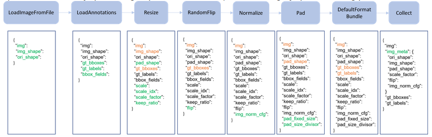

[toc]

# MMDetection’s documentation

- 本仓库为mmdetection 2.25.0版本，其中`git remote`连接两个远端
  - `mmlab`原版代码仓
  - `origin`个人代码仓

## Get Started
- 环境需求：Linux, Windows and macOS. Python 3.6+, CUDA 9.2+ and PyTorch 1.5+.
```bash
# Prerequisites
conda create --name openmmlab python=3.8 -y
conda activate openmmlab
conda install pytorch torchvision -c pytorch
# Installation
pip install -U openmim
mim install mmcv-full
git clone https://github.com/open-mmlab/mmdetection.git
cd mmdetection
pip install -v -e .
# pip install mmdet # use mmdet as a dependency or third-party
# Verify
mim download mmdet --config yolov3_mobilenetv2_320_300e_coco --dest .
python demo/image_demo.py demo/demo.jpg yolov3_mobilenetv2_320_300e_coco.py yolov3_mobilenetv2_320_300e_coco_20210719_215349-d18dff72.pth --device cpu --out-file result.jpg
```

- 其他事项
  - GeForce 30 series需要CUDA 11，cuda版本与GPU驱动版本[查看](https://docs.nvidia.com/cuda/cuda-toolkit-release-notes/index.html#cuda-major-component-versions__table-cuda-toolkit-driver-versions)
  - docker安装`docker build -t mmdetection docker/`
  - docker运行`docker run --gpus all -it -v {DATA_DIR}:/data mmdetection`
  - 不使用`mim`安装`mmcv`，详见[文档](https://mmcv.readthedocs.io/en/latest/get_started/installation.html)

```bash
pip install mmcv-full -f https://download.openmmlab.com/mmcv/dist/cu113/torch1.10/index.html
```

- 预训练权重下载[链接](https://github.com/open-mmlab/mmcv/blob/master/mmcv/model_zoo/open_mmlab.json)，注意区分各模型的`img_norm_cfg`
  - `TorchVision`的ResNet50, ResNet101，`mean=[123.675, 116.28, 103.53], std=[58.395, 57.12, 57.375], to_rgb=True`
  - `Pycls`的RegNetX，`mean=[103.530, 116.280, 123.675], std=[57.375, 57.12, 58.395], to_rgb=False`
  - `MSRA`的Caffe Type，`mean=[103.530, 116.280, 123.675], std=[1.0, 1.0, 1.0], to_rgb=False`
  - `Caffe2`的ResNext101_32x8d，`mean=[103.530, 116.280, 123.675], std=[57.375, 57.120, 58.395], to_rgb=False`

- 对比`Detectron2`，mmdet/detectron2

| Type         | Performance | Training(s/iter) | Inference(img/s) | memory  |
| ------------ | ----------- | ---------------- | ---------------- | ------- |
| Faster R-CNN | 38.0/37.9   | 0.216/0.210      | 22.2/25.6        | 3.8/3.0 |
| Mask R-CNN   | 38.8/38.6   | 0.265/0.261      | 19.6/22.5        | 3.9/3.4 |
| Retinanet    | 37.0/36.5   | 0.205/0.200      | 20.6/17.8        | 3.4/3.9 |

## Quick Run

### Inference with existing models demo

```python
# 推理
from mmdet.apis import init_detector, inference_detector
import mmcv
config_file = 'configs/faster_rcnn/faster_rcnn_r50_fpn_1x_coco.py'
checkpoint_file = 'checkpoints/faster_rcnn_r50_fpn_1x_coco_20200130-047c8118.pth'
model = init_detector(config_file, checkpoint_file, device='cuda:0')
img = 'test.jpg'  # or img = mmcv.imread(img), which will only load it once
result = inference_detector(model, img)
model.show_result(img, result)
model.show_result(img, result, out_file='result.jpg')
# video
video = mmcv.VideoReader('video.mp4')
for frame in video:
    result = inference_detector(model, frame)
    model.show_result(frame, result, wait_time=1)
# ===========================================================================
# 异步推理Asynchronous
import asyncio
import torch
from mmdet.apis import init_detector, async_inference_detector
from mmdet.utils.contextmanagers import concurrent
async def main():
    config_file = 'configs/faster_rcnn/faster_rcnn_r50_fpn_1x_coco.py'
    checkpoint_file = 'checkpoints/faster_rcnn_r50_fpn_1x_coco_20200130-047c8118.pth'
    device = 'cuda:0'
    model = init_detector(config_file, checkpoint=checkpoint_file, device=device)
    streamqueue = asyncio.Queue()
    streamqueue_size = 3
    for _ in range(streamqueue_size):
        streamqueue.put_nowait(torch.cuda.Stream(device=device))
    img = 'test.jpg'  # or img = mmcv.imread(img), which will only load it once
    async with concurrent(streamqueue):
        result = await async_inference_detector(model, img)
    model.show_result(img, result)
    model.show_result(img, result, out_file='result.jpg')
asyncio.run(main())
# ===========================================================================
# Batch Inference
data = dict(train=dict(...), val=dict(...), test=dict(samples_per_gpu=2, ...))
# or pass option
--cfg-options data.test.samples_per_gpu=2
```

### Test existing models on standard datasets

```bash
# single-gpu testing
python tools/test.py ${CONFIG_FILE} ${CHECKPOINT_FILE} [--out ${RESULT_FILE}] \
    [--eval ${EVAL_METRICS}] [--show]
# multi-gpu testing
bash tools/dist_test.sh ${CONFIG_FILE} ${CHECKPOINT_FILE} ${GPU_NUM} \
    [--out ${RESULT_FILE}] [--eval ${EVAL_METRICS}]
# 不指定RESULT_FILE时不会保存文件
# EVAL_METRICS需被数据集支持，如bbox，segm，mAP，recall
# --show用于可视化，--show-dir用于保存可视化结果
./tools/dist_test.sh configs/mask_rcnn/mask_rcnn_r50_fpn_1x_coco.py \
    checkpoints/mask_rcnn_r50_fpn_1x_coco_20200205-d4b0c5d6.pth \
    8 \
    --out results.pkl \
    --eval bbox segm \
    --options "classwise=True"
```

### Train predefined models on standard datasets

- 学习率自动调整：默认学习率是适用于 8 GPU，2 sample per gpu，即batch size = 8 * 2 = 16，通过设置`auto_scale_lr.base_batch_size`调整，或传参`--auto-scale-lr`，依据[论文](https://arxiv.org/abs/1706.02677)
- 训练参数
  - `--work-dir ${WORK_DIR}`指定文件保存目录
  - `--resume-from ${CHECKPOINT_FILE}`从保存的权重恢复训练
  - `resume-from` and `load-from`：`resume`包括权重、训练状态等，而load只加载权重将从0开始训练

```bash
# Training on a single GPU
python tools/train.py ${CONFIG_FILE} [optional arguments]
# Training on multiple GPUs
bash ./tools/dist_train.sh ${CONFIG_FILE} ${GPU_NUM} [optional arguments]
# Single machine multi tasks need different ports (29500 by default)
CUDA_VISIBLE_DEVICES=0,1,2,3 PORT=29500 ./tools/dist_train.sh ${CONFIG_FILE} 4
CUDA_VISIBLE_DEVICES=4,5,6,7 PORT=29501 ./tools/dist_train.sh ${CONFIG_FILE} 4
# Train with multiple machines
# On the first machine:
NNODES=2 NODE_RANK=0 PORT=$MASTER_PORT MASTER_ADDR=$MASTER_ADDR sh tools/dist_train.sh $CONFIG $GPUS
# On the second machine:
NNODES=2 NODE_RANK=1 PORT=$MASTER_PORT MASTER_ADDR=$MASTER_ADDR sh tools/dist_train.sh $CONFIG $GPUS
```

###  Customized Datasets to COCO

- Three ways to support a new dataset
  - 转为`COCO format`，当前评估 `mask AP` 仅支持coco
  - 转为mmdetection的 `middle format`，见[下文](# Customize Datasets)
  - 自定义实现

- 自定义格式数据集`->`COCO格式`->`实现`config`文件`dataset_type`、`data = dict(...)`

```python
# 转为COCO
{
    "images": [image],
    "annotations": [annotation],
    "categories": [category]
}
image = {
    "id": int,
    "width": int,
    "height": int,
    "file_name": str,
}
annotation = {
    "id": int,
    "image_id": int,
    "category_id": int,
    "segmentation": RLE or [polygon],
    "area": float,
    "bbox": [x,y,width,height],
    "iscrowd": 0 or 1,
}
categories = [{
    "id": int,
    "name": str,
    "supercategory": str,
}]
# 修改config的classes，data.train, data.val and data.test
dataset_type = 'XXXDataset'  # coco type
classes = ('a', 'b', 'c', 'd', 'e')
data = dict(
    samples_per_gpu=2, workers_per_gpu=2,
    train=dict(
        type=dataset_type,
        # explicitly add your class names to the field `classes`
        classes=classes,
        ann_file='path/to/your/train/annotation_data',
        img_prefix='path/to/your/train/image_data'),
    val=dict(
        type=dataset_type,
        # explicitly add your class names to the field `classes`
        classes=classes,
        ann_file='path/to/your/val/annotation_data',
        img_prefix='path/to/your/val/image_data'),
    test=dict(
        type=dataset_type,
        # explicitly add your class names to the field `classes`
        classes=classes,
        ann_file='path/to/your/test/annotation_data',
        img_prefix='path/to/your/test/image_data'))
# 修改config的model里的num_classes
model = dict(
    roi_head=dict(
        bbox_head=[
            dict(
                type='Shared2FCBBoxHead',
                # explicitly over-write all the `num_classes` field from default 80 to 5.
                num_classes=5),
            dict(
                type='Shared2FCBBoxHead',
                # explicitly over-write all the `num_classes` field from default 80 to 5.
                num_classes=5),
            dict(
                type='Shared2FCBBoxHead',
                # explicitly over-write all the `num_classes` field from default 80 to 5.
                num_classes=5)],
    # explicitly over-write all the `num_classes` field from default 80 to 5.
    mask_head=dict(num_classes=5)))
```

### Customized Models

- 使用标准数据集训练自定义模型，`export MMDET_DATASETS=$data_root`
- 下载`cityscapes`数据集：`pip install cityscapesscripts`，COCO数据集[格式](https://cocodataset.org/#format-data)
- 示例：替换模型的`FPN`为`AugFPN`

```python
# mmdet/models/necks/augfpn.py
from ..builder import NECKS
@NECKS.register_module()
class AugFPN(nn.Module):
    def __init__(self,
                in_channels,
                out_channels,
                num_outs,
                start_level=0,
                end_level=-1,
                add_extra_convs=False):
        pass
    def forward(self, inputs):
        # implementation is ignored
        pass
```

- 导入模型

```python
# mmdet/models/necks/__init__.py
from .augfpn import AugFPN
# 或者在config导入
custom_imports = dict(
    imports=['mmdet.models.necks.augfpn.py'],
    allow_failed_imports=False)
# 在config中构建
neck=dict(
    type='AugFPN',
    in_channels=[256, 512, 1024, 2048],
    out_channels=256,
    num_outs=5)
```

## Tutorials

### Configs

- 更新config参数
  - 使用脚本查看完整配置`python tools/misc/print_config.py /PATH/TO/CONFIG`
  - 更新链式参数项，如`--cfg-options model.backbone.norm_eval=False`
  - 更新列表参数内部项：`--cfg-options data.train.pipeline.0.type=LoadImageFromWebcam`
  - 更新列表参数，`--cfg-options workflow="[(train,1),(val,1)]"`

- config结构组成：`dataset, model, schedule, default_runtime`，详见`config/_base_`
- config命名：`{model}_{backbone}_{neck}_[norm]_[misc]_[gpu x batch_per_gpu]_{schedule}_{dataset}`
- 继承base之后，使用`_delete_=True,`删除旧配置项

### Customize Datasets

- 自定义数据集转为`middle format`，然后继承`CustomDataset`并实现`load_annotations(self, ann_file)`和 `get_ann_info(self, idx)`

```python
[
    {
        'filename': 'a.jpg',
        'width': 1280,
        'height': 720,
        'ann': {
            'bboxes': <np.ndarray, float32> (n, 4),
            'labels': <np.ndarray, int64> (n, ),
            'bboxes_ignore': <np.ndarray, float32> (k, 4),
            'labels_ignore': <np.ndarray, int64> (k, ) (optional field)
        }
    },
    ...
]
```

- 自定义格式的数据集

```bash
#
000001.jpg
1280 720
2
10 20 40 60 1
20 40 50 60 2
#
000002.jpg
1280 720
3
50 20 40 60 2
20 40 30 45 2
30 40 50 60 3
```

- 实现数据集类

```python
# mmdet/datasets/my_dataset.py 
import mmcv
import numpy as np
from .builder import DATASETS
from .custom import CustomDataset

@DATASETS.register_module()
class MyDataset(CustomDataset):
    CLASSES = ('person', 'bicycle', 'car', 'motorcycle')
    def load_annotations(self, ann_file):
        ann_list = mmcv.list_from_file(ann_file)
        data_infos = []
        for i, ann_line in enumerate(ann_list):
            if ann_line != '#':
                continue
            img_shape = ann_list[i + 2].split(' ')
            width = int(img_shape[0])
            height = int(img_shape[1])
            bbox_number = int(ann_list[i + 3])
            anns = ann_line.split(' ')
            bboxes = []
            labels = []
            for anns in ann_list[i + 4:i + 4 + bbox_number]:
                bboxes.append([float(ann) for ann in anns[:4]])
                labels.append(int(anns[4]))
            data_infos.append(
                dict(
                    filename=ann_list[i + 1],
                    width=width,
                    height=height,
                    ann=dict(
                        bboxes=np.array(bboxes).astype(np.float32),
                        labels=np.array(labels).astype(np.int64))
                ))
        return data_infos

    def get_ann_info(self, idx):
        return self.data_infos[idx]['ann']
```

- 在config中使用

```python
dataset_A_train = dict(
    type='MyDataset',
    ann_file = 'image_list.txt',
    pipeline=train_pipeline
)
```

- 其他用法见[文件](mmdet/datasets/custom_example.py)

### Data Pipelines



- 组成部分
  - Data loading：`LoadImageFromFile`，`LoadAnnotations`，`LoadProposals`
  - Pre-processing：`Resize`，`RandomFlip`，`Pad`，`RandomCrop`，`Normalize`，...
  - Formatting：`ToTensor`，`ImageToTensor`，`Transpose`，Collect`，...
  - Test time augmentation：`MultiScaleFlipAug`

- 自定义custom pipelines

```python
import random
from mmdet.datasets import PIPELINES

@PIPELINES.register_module()
class MyTransform:
    """Add your transform
    Args:
        p (float): Probability of shifts. Default 0.5.
    """
    def __init__(self, p=0.5):
        self.p = p
    def __call__(self, results):
        if random.random() > self.p:
            results['dummy'] = True
        return results
```

- 在config中使用

```python
custom_imports = dict(imports=['path.to.my_pipeline'], allow_failed_imports=False)
img_norm_cfg = dict(
    mean=[123.675, 116.28, 103.53], std=[58.395, 57.12, 57.375], to_rgb=True)
train_pipeline = [
    dict(type='LoadImageFromFile'),
    dict(type='LoadAnnotations', with_bbox=True),
    dict(type='Resize', img_scale=(1333, 800), keep_ratio=True),
    dict(type='RandomFlip', flip_ratio=0.5),
    dict(type='Normalize', **img_norm_cfg),
    dict(type='Pad', size_divisor=32),
    dict(type='MyTransform', p=0.2),
    dict(type='DefaultFormatBundle'),
    dict(type='Collect', keys=['img', 'gt_bboxes', 'gt_labels']),
]
```

### Customize Models

- 包括5种类型：`backbone`、`neck`、`head`、`roi extractor`、`loss`
- 定义新模型

```python
# mmdet/models/backbones/mobilenet.py.
import torch.nn as nn
from ..builder import BACKBONES

@BACKBONES.register_module()
class MobileNet(nn.Module):
    def __init__(self, arg1, arg2):
        pass
    def forward(self, x):  # should return a tuple
        pass
# mmdet/models/backbones/__init__.py
from .mobilenet import MobileNet
# 或在config添加
custom_imports = dict(
    imports=['mmdet.models.backbones.mobilenet'],
    allow_failed_imports=False)
# 使用新模型
model = dict(
    ...
    backbone=dict(
        type='MobileNet',
        arg1=xxx,
        arg2=xxx),
    ...
```

### Runtime Settings

https://mmdetection.readthedocs.io/en/latest/tutorials/customize_runtime.html


